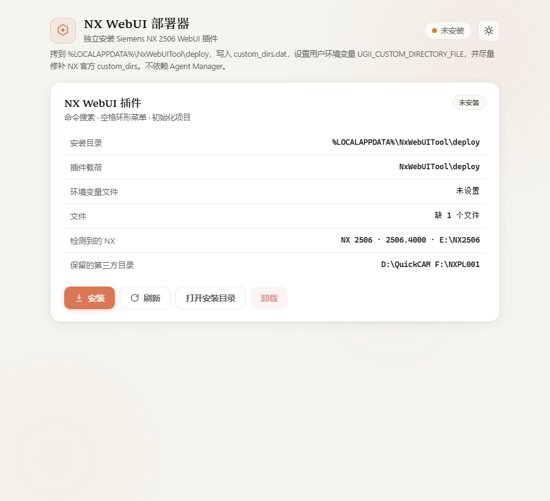
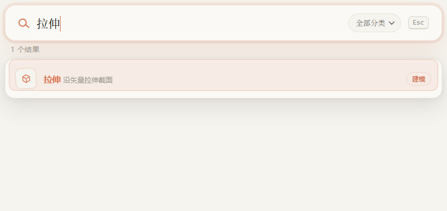
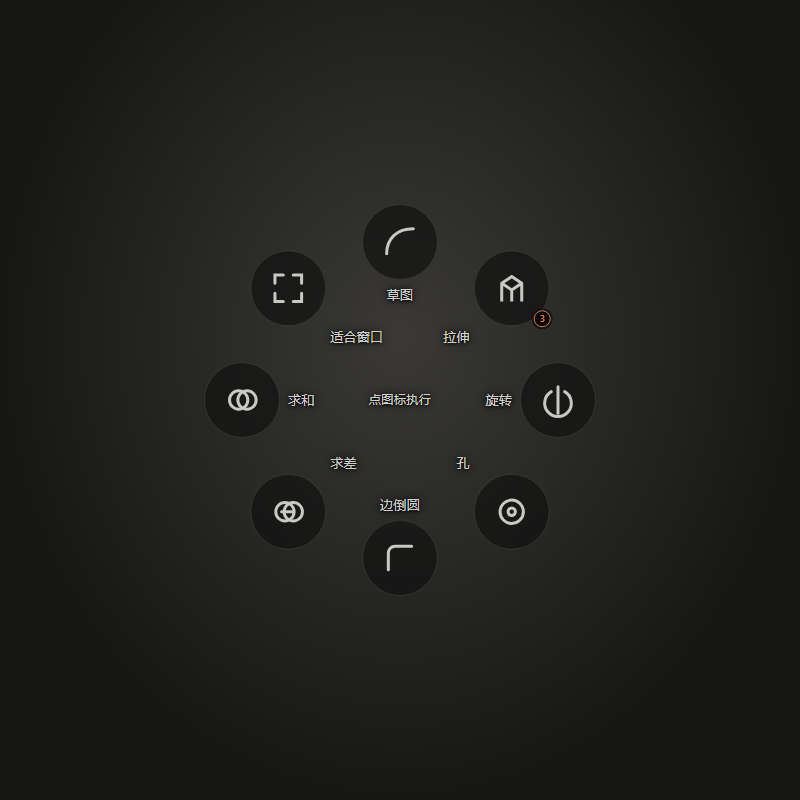
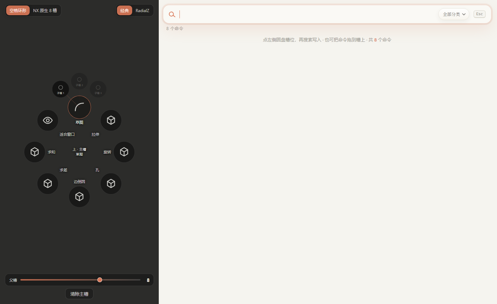

# NX WebUI

[](LICENSE)
[](https://github.com/Jersyi2002/NXWebUI/stargazers)
[](https://www.plm.automation.siemens.com/)
[](#notes)

One-click install for the Siemens NX 2506 WebUI plugin.

Quit NX, run the deployer, restart NX. Command search, the spacebar radial menu, and project init load without Agent Manager.

## Demo

Deployer, Alt+Q search, spacebar radial menu, and the slot editor.

<p align="center">
  
</p>

<p align="center">
  
</p>

<p align="center">
  
</p>

<p align="center">
  
</p>

## Install

Plugin C# and webui live in `NxWebUITool`. Compile them against NX 2506, then build the deployer so it can copy `NxWebUITool\deploy` into `dist\payload`.

```powershell
git clone https://github.com/Jersyi2002/NXWebUI.git
cd NXWebUI
dotnet build NxWebUITool\NxWebUITool.slnx -c Release
dotnet build NxWebUIDeployer.slnx -c Release
```

Windows x64, .NET SDK, [WebView2 Runtime](https://developer.microsoft.com/microsoft-edge/webview2/), and NX 2506 managed DLLs. Default `NxBase` is `E:\NX2506`. Override with `-p:NxBase=D:\path\to\NX2506` if yours lives elsewhere.

## Quickstart

Fully quit Siemens NX (`ugraf.exe`), then:

```powershell
.\dist\NxWebUIDeployer.exe
```

Click 安装. The deployer copies the plugin to `%LOCALAPPDATA%\NxWebUITool\deploy`, writes `custom_dirs.dat`, and sets user env `UGII_CUSTOM_DIRECTORY_FILE`. Restart NX 2506 with a full quit, not File then New.

`启动部署器.bat` builds the plugin and the exe if they are missing, then starts the same program.

## What you can do

- **Install or repair:** copies `startup\` and `application\` and registers them for desktop NX.
- **Keep other products:** merges custom directories and leaves QuickCAM and NXPL001 in place.
- **Refuse a live session:** blocks install and uninstall while `ugraf.exe` is running so DLLs are not overwritten.
- **Uninstall cleanly:** removes the LocalAppData copy and restores the previous environment variable.

## Keyboard shortcuts

| Key | Action |
| --- | --- |
| `Alt+Q` | Command search |
| Hold `Space` | Radial menu, release to run |

## Requirements

- **Windows x64:** the UI is WinForms plus WebView2, not a web server.
- **Siemens NX 2506:** plugin binaries, menus, and NXOpen references target that release.
- **Plugin payload:** after the two `dotnet build` commands, `dist\payload` sits beside the exe. You can also set `NXWEBUI_PAYLOAD` to any folder that already contains `startup\` and `application\`.
- After any plugin DLL or webui change, fully quit NX, then click 修复 / 更新.

## Notes

This repository is **full vibe coding**. The NX plugin, deployer, and webui were written with AI coding agents from prompts, then compiled and tested on NX 2506.

The spacebar menu has two looks: **classic** and **RadialZ**. The RadialZ style (dark disc, coral accent, nested child slots) is inspired by [RadialZ](https://www.radialz.app/), a radial brush menu for ZBrush. NX WebUI is an independent NX plugin and is not affiliated with RadialZ.

## License

MIT
